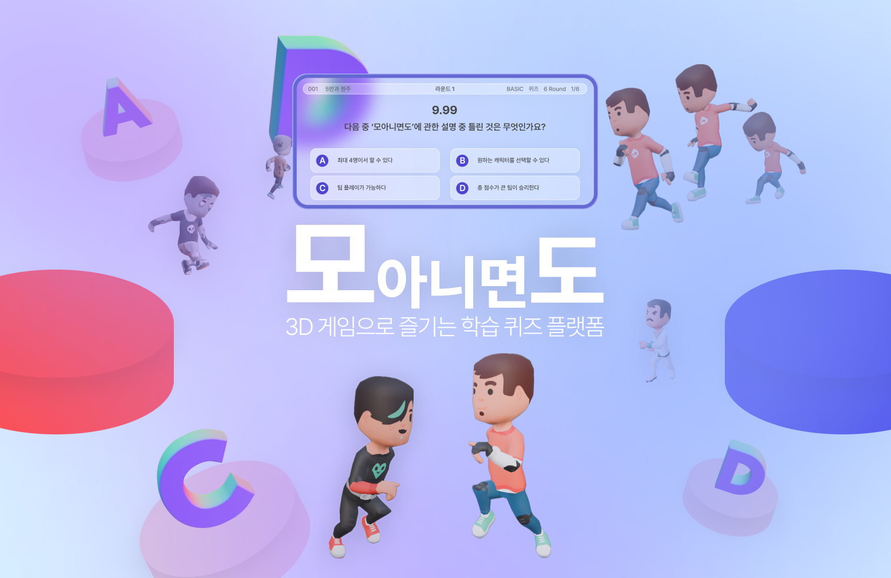
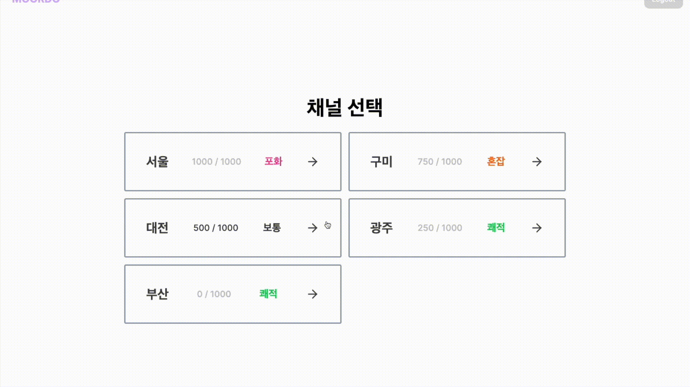
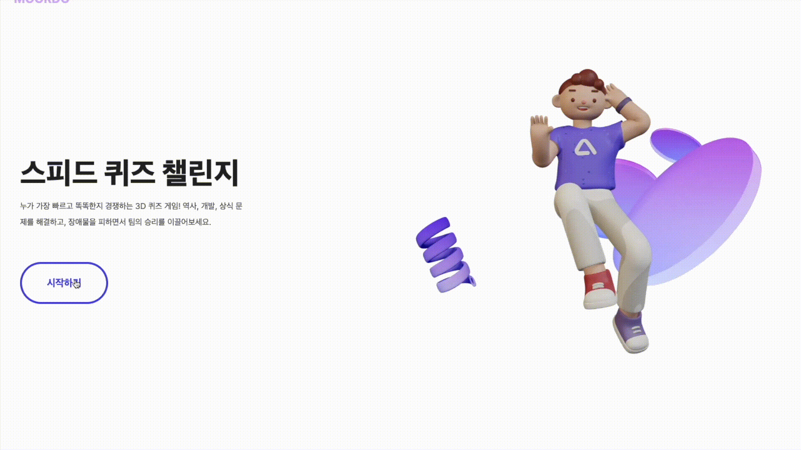

# 모 아니면 도 | 3D 게임으로 즐기는 학습 퀴즈 플랫폼

  
  

## 🌟 주요 기능

### 게임

<table>
  <tbody>
    <tr>
      <td align="center" valign="top" width="25%" > <b>1. 대기 모드 </b> 
      게임 방에 입장하면 우선 대기 모드입니다. 대기 모드에서는 전광판에 게임 플레이 방법과 팀 선택 안내 문구가 나옵니다.
      </td>
    </tr>
    <tr>
      <td align="center" valign="top" width="25%" > <b>2. 팀 선택</b> 
      플레이어는 키보드를 통해 직접 움직여 팀을 선택할 수 있습니다. 모든 플레이어가 비율에 맞게 팀 선택을 완료하면 방장의 화면에는 `START` 버튼이 활성화되고 클릭하면 게임이 시작됩니다.
      </td>
    </tr>
    <tr>
      <td align="center" valign="top" width="25%" > <b>3. 퀴즈 출제</b> 
      게임이 시작되면 전광판에 퀴즈가 출제됩니다. 방장이 설정한 게임 주제에 맞는 퀴즈가 10초 동안 제시되고 10초가 지나면 모든 플레이어는 다시 중앙으로 리스폰됩니다.
      </td>
    </tr>
    <tr>
      <td align="center" valign="top" width="25%" > <b>4. 퀴즈 결과 및 순위 표시</b> 
      퀴즈가 출제된 10초가 지나면 퀴즈 정답과 결과가 표시됩니다. 가장 빨리 맞춘 플레이어 기준으로 1위 부터 3위가 표시되고 맞춘 시간에 비례하여 점수를 얻습니다. 플레이어가 얻은 점수는 팀 점수에 합산됩니다.
      </td>
    </tr>
  </tbody>
</table>

### 채널 | 로비 | 방 생성

<table>
  <tbody>
    <tr>
      <td align="center" valign="top" width="25%" > <b>1. 채널 선택 페이지</b> 
      로그인이 된 상태에서 홈 화면의 시작하기 버튼을 누르면 채널 선택 페이지로 이동합니다. 채널은 `쾌적`, `보통`, `혼잡`, `포화` 총 4가지 상태가 있습니다.
      </td>
    </tr>
    <tr>
      <td align="center" valign="top" width="25%" > <b>2. 게임 방 생성</b> 
      채널을 선택하고 로비에 들어오면 생성된 방 리스트를 볼 수 있습니다. 방 상태는 비밀 방과 일반 방, 게임 진행 중인 방과 대기 모드인 방이 있습니다. 대기 모드이면서 플레이어 인원 수가 만석이 아닐 때에만 클릭을 통해 입장할 수 있습니다.
      </td>
    </tr>
    <tr>
      <td align="center" valign="top" width="25%" > <b>2. 채팅</b> 
      채팅을 통해 다른 플레이어와 실시간 소통이 가능합니다. 채팅 기능은 게임 방과 로비에서 모두 제공돕니다. 로비에서의 채팅은 채널별로 다르게 보입니다.
      </td>
    </tr>
  </tbody>
</table>

### 홈 | 로그인 | 마이페이지

<table>
  <tbody>
    <tr>
      <td align="center" valign="top" width="25%" > <b>1. 홈 화면</b> 
      mo-or-do.net 사이트에 들어가면 가장 먼저 보이는 홈 화면입니다. 게임 플레이 방법과 간단한 설명이 안내됩니다.
      </td>
    </tr>
    <tr>
      <td align="center" valign="top" width="25%" > <b>2. 소셜 로그인</b> 
      카카오 소셜 로그인을 통해 간편 회원가입을 할 수 있습니다.
      </td>
    </tr>
  </tbody>
</table>

  

## 👩🏻‍💻 R&R

|                                                                       FE                                                                       |                                                                          FE                                                                          |                                                                        FE                                                                         |
| :--------------------------------------------------------------------------------------------------------------------------------------------: | :--------------------------------------------------------------------------------------------------------------------------------------------------: | :-----------------------------------------------------------------------------------------------------------------------------------------------: |
|  |  |  |
|                                                       [이원주](https://github.com/3o14)                                                        |                                                       [이우성](https://github.com/leewooseong)                                                       |                                                       [이재민](https://github.com/Chosamee)                                                       |
|                                          - 게임방 및 퀴즈 출제  - 3D 캐릭터 모델링 및 움직임 구현                                          |                                                   - 채널 선택 & 로비 페이지  - 소켓 통신 구현                                                    |                                                    - 소켓 통신 구현  - 멀티 플레이어 구현                                                     |

|                                                                         BE                                                                         |                                                                        BE                                                                        |
| :------------------------------------------------------------------------------------------------------------------------------------------------: | :----------------------------------------------------------------------------------------------------------------------------------------------: |
|  |  |
|                                                       [남동우](https://github.com/WhalesBob)                                                       |                                                       [오세영](https://github.com/osy9536)                                                       |
|                                              - 게임방 & 채널 api 제작  - 네이티브 소켓 통신 구현                                               |                                             - 로비 & 로그인 api 제작  - 네이티브 소켓 통신 구현                                              |

|                                                                         DevOps                                                                          |
| :-----------------------------------------------------------------------------------------------------------------------------------------------------: |
|  |
|                                                       [신창엽](https://github.com/404-not-foundl)                                                       |
|                                                          - CI/CD 파이프라인 구축  - 모니터링 시스템 설정 |

  

## 🛠️ System Architecture

